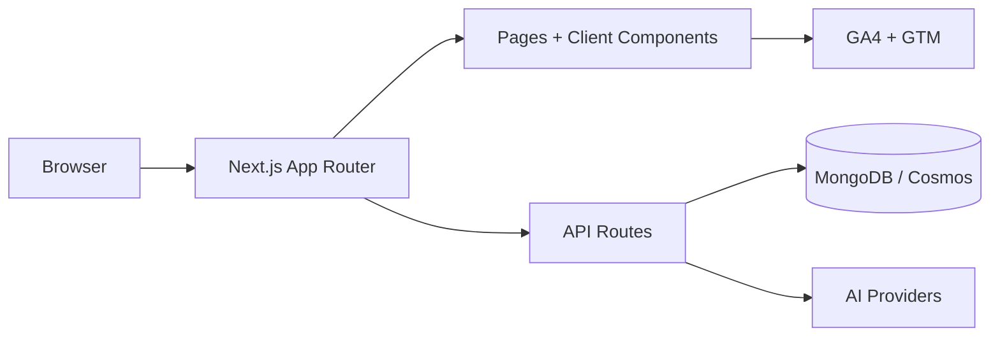

# Trainer AI

AI-assisted workout and meal planning with session tracking. Built with Next.js App Router, TypeScript, Tailwind, and MongoDB/Cosmos.

## Architecture

## Local setup

1. Use Node.js 20 (nvm recommended).
   - `nvm use 20.19.6`
2. Install dependencies.
   - `npm install`
3. Configure environment variables.
   - `cp .env.example .env`
   - Fill in required values.
4. Start the dev server.
   - `npm run dev`

## Environment variables

Required:
- `MONGODB_URI` - MongoDB connection string.
- `JWT_SECRET` - secret used to sign auth cookies.

Optional (AI providers):
- `GEMINI_API_KEY`
- `OPENROUTER_API_KEY`
- `MISTRAL_API_KEY`
- `GROQ_API_KEY`
- `CEREBRAS_API_KEY`

Optional (analytics):
- `NEXT_PUBLIC_GA_ID`
- `NEXT_PUBLIC_GTM_ID`

Optional (OAuth):
- `GOOGLE_CLIENT_ID`
- `GOOGLE_CLIENT_SECRET`
- `FACEBOOK_CLIENT_ID`
- `FACEBOOK_CLIENT_SECRET`
- `APPLE_CLIENT_ID`
- `APPLE_CLIENT_SECRET`

## API endpoints

Auth:
- `POST /api/auth/signup` - create account and set auth cookie.
- `POST /api/auth/login` - authenticate and set auth cookie.
- `POST /api/auth/logout` - clear auth cookie.
- `GET /api/auth/oauth/:provider` - start OAuth flow.
- `GET /api/auth/oauth/:provider/callback` - OAuth callback handler.

User:
- `GET /api/me/profile` - fetch profile.
- `PUT /api/me/profile` - update or create profile.
- `GET /api/me/settings` - fetch settings.
- `PUT /api/me/settings` - update settings.
- `POST /api/me/avatar` - upload profile avatar.
- `PUT /api/me/password` - change password.

Plans:
- `GET /api/plans/active` - fetch active workout/diet plan.
- `POST /api/plans/generate-workout` - generate workout plan.
- `POST /api/plans/workout-image` - regenerate exercise image.
- `POST /api/plans/generate-diet` - generate diet plan.
- `POST /api/plans/diet-image` - regenerate diet image.

AI models:
- `GET /api/ai-models` - list AI models.
- `POST /api/ai-models` - create AI model config.
- `GET /api/ai-models/:id` - get model details.
- `PUT /api/ai-models/:id` - update model.
- `DELETE /api/ai-models/:id` - delete model.

Messages:
- `GET /api/messages` - list AI messages.
- `POST /api/messages` - send message.
- `POST /api/messages/rate` - rate a response.

Workout sessions:
- `POST /api/workout-sessions` - create a workout session.
- `GET /api/workout-sessions` - list sessions.
- `GET /api/workout-sessions/:id` - get a session.
- `PATCH /api/workout-sessions/:id` - update a session.

## Scripts

- `npm run dev` - local dev server.
- `npm run build` - production build.
- `npm run start` - serve production build.
- `npm run lint` - lint.
- `npm run test` - Jest unit/API tests.
- `npm run test:watch` - Jest watch mode.
- `npm run e2e` - Playwright end-to-end tests (starts dev server).
- `npm run e2e:ui` - Playwright UI mode.

## Testing notes

- Playwright uses a local dev server and sets `E2E_MOCKS=true` to avoid DB dependencies in some flows.
- Install Playwright browsers once: `npx playwright install`.
